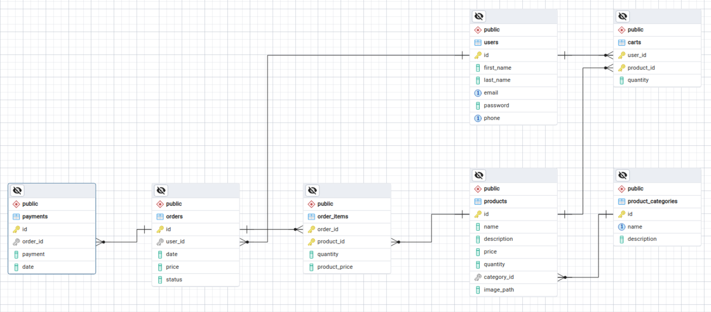

# Shop API

Универсальный Rest API с базовым функционалом для организаций, занимающихся продажей собственных товаров. 

## Описание проекта

### Предметная область
Приложение должно хранить информацию о товарах, пользователях, заказах, позиций заказа, категориях товаров, оплатах, корзине:

